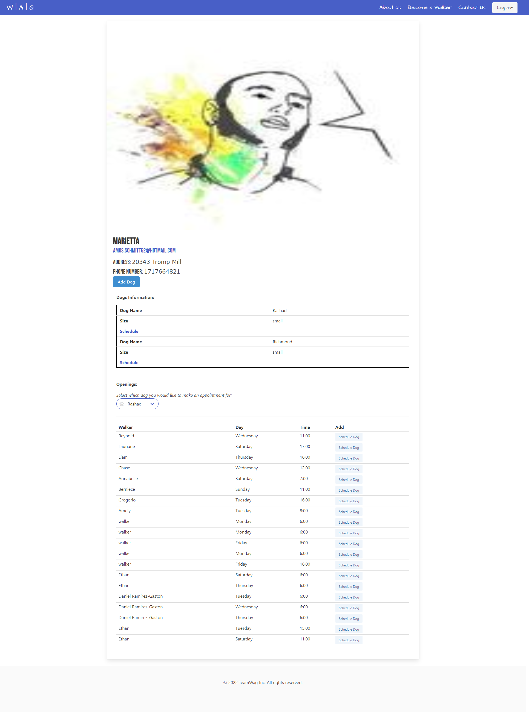
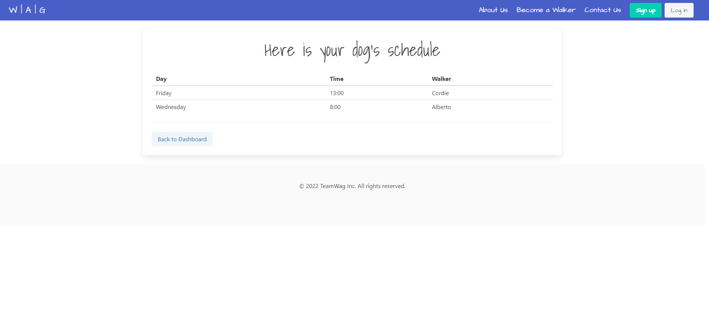
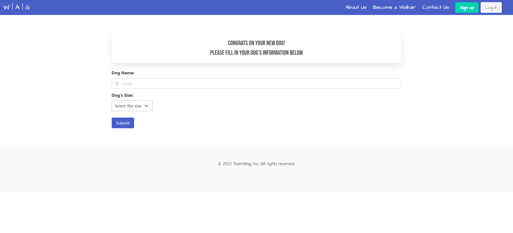
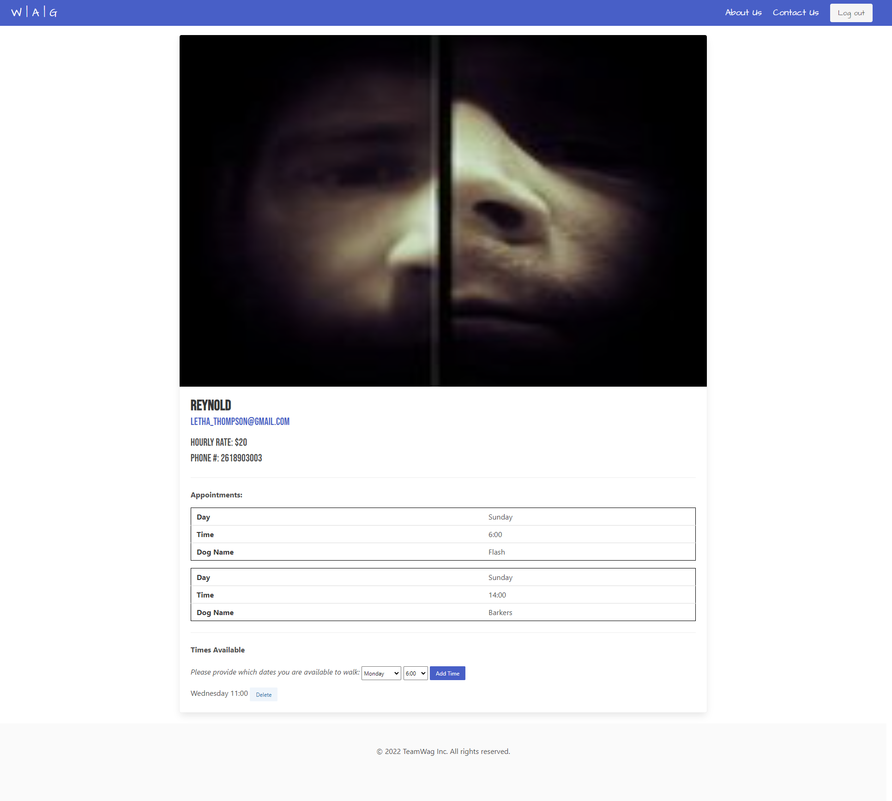

# Wag: Connecting Dogs with Their Walkers

https://secure-savannah-19572.herokuapp.com/

To login with mock credentials use the following:
Owner:
- Email: Amos.Schmitt62@hotmail.com
- Password: password

Walker:
- Email: Letha_Thompson@gmail.com
- Password: password

## Description

Wag is a social media platform to connect dog walkers and dog owners. Owners creat profiles and dogs attached to their accounts, and can check avialable openings from walkers.

Walkers can create profiles and add openings for dog owners to find them by.

## Contents

### Technology

The following dependencies are used in production:
- bcrypt: for hashing passwords
- dotenv: for loading environment variables, to prevent publication of sensitive information
- express: for building the web applications, specifically through router calls on the server side
- express-session: for creating session middleware using express.js
- handlebars: for building web templates
- express-handlebars: for supporting partials and other features within express
- mysql2: for accessing and querying MySQL
- sequelize: for accessing and querying the database in JavaScript
- connect-session-sequelize: for storing sessions in SQL via sequalize

The following are used in development:
- @faker-js/faker (referred to as faker). Listed in package.json as a production level dependency to avoid issues with ESLint
- Prettier
- Various ESLint packages

### Models

The database has four related tables.

- Owners, who own the dogs
- Walkers, who walk the Dogs
- Dogs
- Calendar, which stores weekly appointments between walkers and dogs

Owners can have many dogs. Appointments in the Calendar store one walker and at most one dog (appointments without dogs attached are ones where the walker is available). Nothing prevents a Walker from walking more than one dog is the same time frame.

### Mock Data

The faker module simulates data for testing purposes, and can be found in the seeds file.

## Website

https://secure-savannah-19572.herokuapp.com/

## License

This project is licensed under the MIT license

## Contact

This app was developed by the following people:
- Christopher Backes | [github](https://github.com/chris-backes/)
- Danny Ramirez | [github](https://github.com/dannyramirezgd/)
- Daniel Kim | [github](https://github.com/danielkim13/)